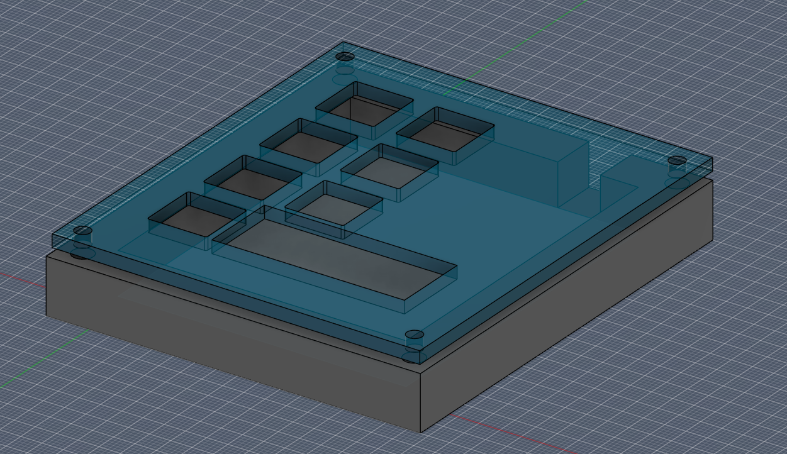
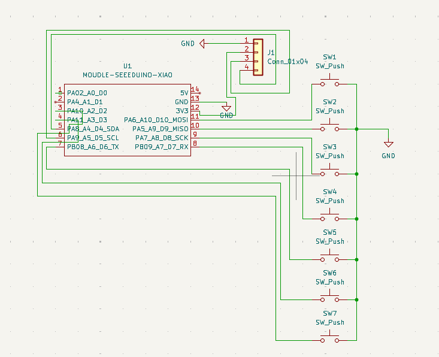
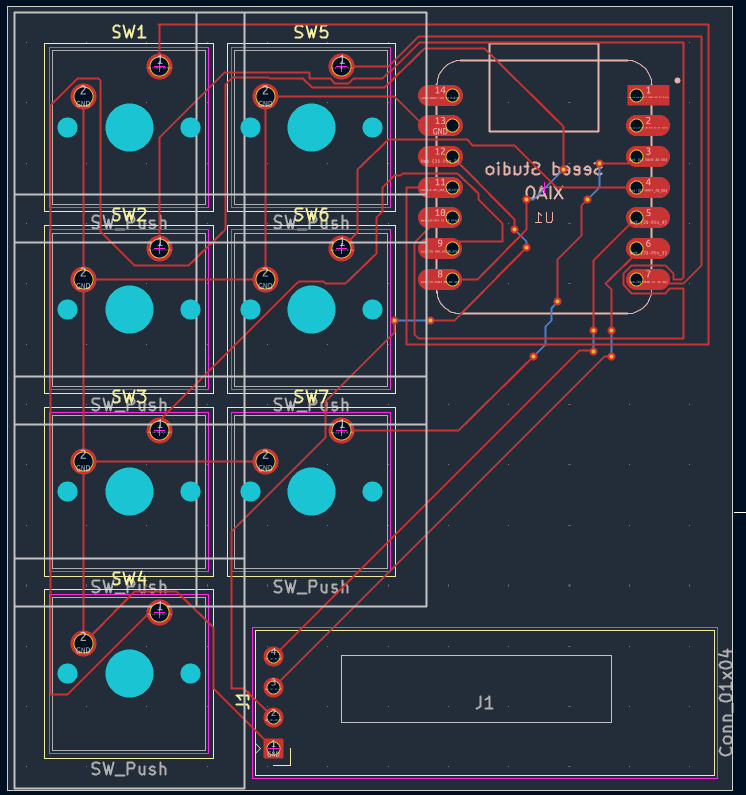

# hackpad

This is my submission for the hackpad mission! This is my first time using KiCad and Autodesk Fusion so I'm not very experienced. Decided to make this because I wanted to make some automation easier, as it binds the keys to F13-19, which are unused usually.

It also includes a bongo cat animation, that activates when you press any key on the macropad. Code is from github over [here](https://github.com/qmk/qmk_firmware/pull/19334/changes).

## Specifications

- Xiao RP2040
- 7 keys
- 0.91' OLED Display

## Bill of Materials

| **Name**                          | **Quantity** |
| --------------------------------- | ------------ |
| Seeed XIAO RP2040 microcontroller | 1            |
| MX-style mechanical switches      | 7            |
| 0.91" 128x32 OLED Display         | 1            |
| Blank DSA keycaps                 | 7            |
| M3x16mm Screws                    | 4            |
| M3x5x4mm heatset inserts          | 4            |
| PCB                               | 1            |
| Case                              | 1            |

Also available in `bom.csv`

## Images

_The case assembled (top part made transparent for visibility, not in actual model)_

_Schematic of the PCB_

_PCB design_
